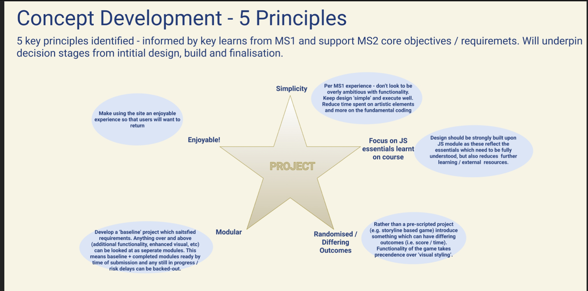
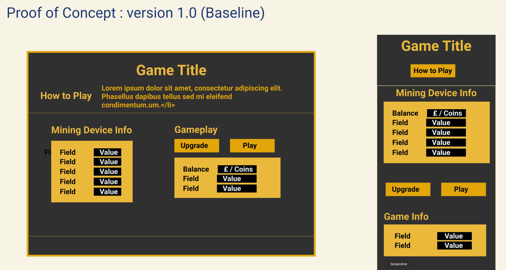
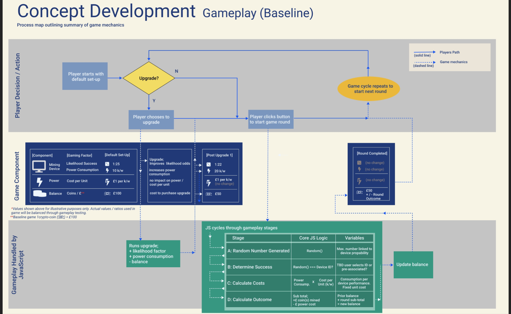
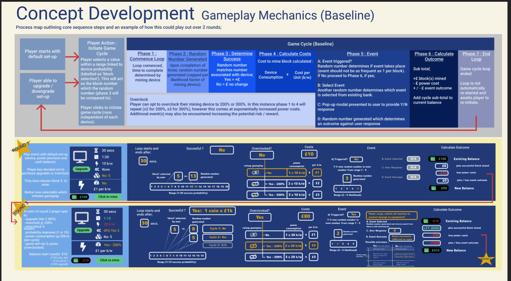
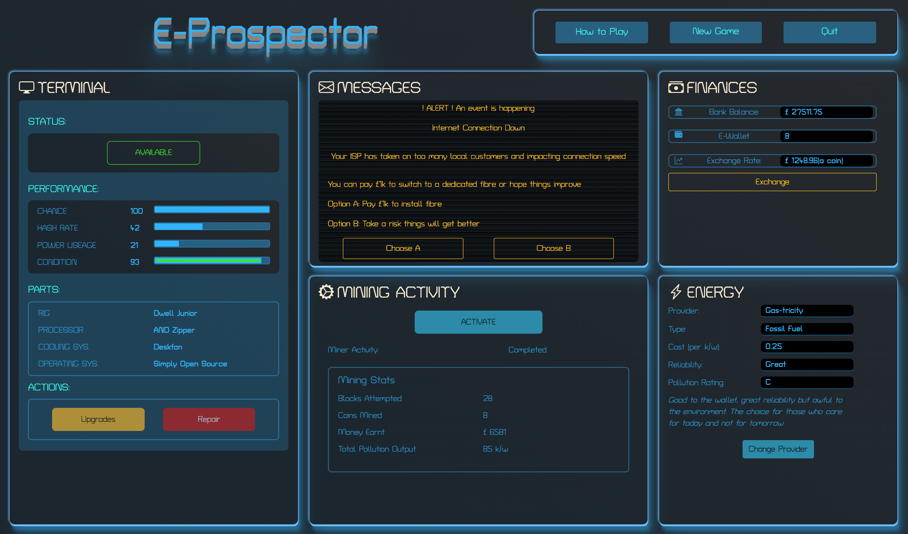

# E-Prospector - a Cybercurrency Mining Game

## Links to;

[E-Prospector - Live Site](https://kelvenh.github.io/E-Prospector.v2/)

[GitHub Repo](https://github.com/KelvenH/E-Prospector.v2)

***

## Contents

1. [Overview](#Overview)
2. [UX](#UX)
3. [User Stories](#User-Stories)
4. [Design](#Design)
5. [Content and Key Features](#Content-and-Key-Features)
6. [Future Enhancements](#Future-Enhancements)
7. [Technologies Used](#Technologies-Used)
8. [Bugs and Defects](#Bugs-and-Defects)
10. [Deployment](#Deployment)
11. [Acknowledgements](#Acknowledgements)

---
## Overview
E-Prospector is a digital block mining game. The purpose of the game is to generate Bit coins which can be exchanged for currency which in turn is used to 'pay' for power costs and upgrade elements. The game has a dashboard style layout to prevent 'lose of scrore' which would be encountered if the page were to be re-loaded. 

---

## UX

### User Stories 

### Client Goals 
Site visitors ;
-    Users want to;
      * navigate the site easily
      * understand how to play
      * be able to manage any inputs / actions easily  
      * see what ‘performance score / stats’ they have
      * make interactive decisions to determine game outcome
      * have fun! 

### Approach
Development was documented and is available [here] (/README-Files/WorkingE-ProposectorDevelopmentFile.pdf)
5 key principles were identified to underpin the decisions from the inital design through to the build. These were;
* Simplicity - design should not look to be over ambitious given this is first attempt with JavaScript!
* Focus on core elements learnt on the module - reduce need to seek external referrences
* Randomised Ouctomes - game should have differing ouctomes but player has some influence 
* Modular Build - rather than attempt to build out the complete 'end design' go through iterative stages and build on / add to / improve
* Enjoyable - produce something that has a sleek look and is enjoyable to play.

Example from working file of the initial game concept

Mapping out core game mechanics 

Expanded to deomonstrate possible further enhancements

 
End Result - player dashboard

 

 
### Design
* Site should have a clean crisp look and feel.
* Have a styling which is in keeping with the 'digital' topic.
* Single page is crucial - as there is no back end / save game capability any page loas / refreshes would lose current progress. 
* Pop-up modals / accordion sections where additional screen estate is needed
* The game area will have a 'dashboard' style layout.

---
### Content and Key Features

* The game area will consist of a single full page dashboard.
* JavaScript handling the game mechanics.
* Players 'earn' rewards in BitCoins and opt when to exchange for £GBP 
* Fluid exchange rate
* Upgradeable elements to improve player likelihoods
* Gameplay linked to player actions with randomised outcomes based on probabilities

###  Future Enhancements
   There were a number of features which have not yet been implemented as intended. These include;
  - ability to change crypto-curencies
  - more enhanced set of events
  - improved balancing of game probability ratings
  - improved layout for smaller screens

---
### Technologies Used

Languages:

HTML5

CSS3

JavaScript / JSON

Google Fonts

Bootstrap 5.0 inc. Bootstrap Icons

Font Awesome

Adobe Illustrator

---

### Bugs and Defects

Development of this game was through a modular style and as such bugs encountered along the way were resolved as part fo the next build, or in some cases re-designed. Excluding game elements which were unable to implement due to time (see Future Enhancements), a few issues remain in the game as tabled below. 

   Issue                                |  Description                                                                                                   |       
--------------------------------------- |----------------------------------------------------------------------------------------------------------------|
Unexpected behaviour | Some instances noticed of unexpected behaviour where gameplay flows through the mutipe functions / scenarios which are not easy to replicate. For exmaple, there can be occassions where the in game check (to identify if balance nil / game over) can occur in the midst of another stage of gameplay leading to a game over message and play continuing. Likley needs a more specific set of functional flow to avoid these being encountered, but instances were low and difficult to replicate in development.

---

### Git and Deployment

Build and deployment was delivered through GitHub, GitPod, GitPages and to a lesser extent GitDektop.

Day to day development is performed through GitPod which is used to interact with the repository on GitHub.
The terminal console within GitPod is used to synchronise changes between the two. Key commands are;

## Git Status 
- overview of current files in GitPod which are either waiting to be committed (unsent changes), untracked (new) or files deleted in GitPod but still held in current repo.

## Git add <file / folder name> 
- adds the new / updated file to a staging area ready to be committed. Where files share similarity in path and naming convention (e.g. multiple sized versions of same image) an asterick can be added against part of the name (such as assets/images/landscape* would add multiple versions of the image which started with the same name.

## Git add .  
- will add all files and folders to be committed including those where no changes are pending for upload. Note that early on this was misunderstood for meanining this was a shortcut for adding all files waiting to be committed. It was not until around mid-way through development that this was realised and whilst it has no adverse affect on the files content, it has meant that the same accompanying comments are loaded against all files where they have no relevance.

## Git commit -m "<comments>"
sends all files in the staging area to the GitHub repo.   

## Git rm <file / folder name> 
- removes any files currently staged (changes are not lost, just not held in the staging area)

## Git restore <file / folder name>  
- restores uncomitted files back to align with the version held in the main branch. For example, this could be used to 'undo' changes which have been saved locally but not yet committed or restore a file which has been deleted in GitPod (but remains available to retrieve from GitHub).

## Git push
- after changes have been comitted, this command will synchronise the changes with the main branch, bringing workspace, local repository and main (remote repository) in alignment.

## Forking 
Is the process by which versions of the files can be made. Whilst this is normal practice for web / app / software development, it enables mutiple users to work on aspects of the files at the same time. This was not something i needed to do as part of this project. However, GitHub allows forks to be created of any users repos (if made public) so a couple of other users repos were made to understand how this worked.

## Cloning 
This enables a complete clone of a repo to be made. Having installed GitDesktop i made a clone so as i could manage updates without having to pull from GitHub. However, this is an area to explore further as I failed to realise what benefit this was providing and feared risk of creating conflicts / multiple versions.

## Deployment 

- User starts from Github repository
- go to repo settings - cog icon displayed above repo information (not settings cog displayed slightly to the side of the repo which is general Github settings)
- scroll down to section "Github Pages"
- Source will display 'none' prior to the site being deployed.This is changed by clicking on the dropdown and selecting 'Master' (i noted Git documentation used the term 'main' so may be either or(?)
- Save the change. The site will then be generated (via GitPages) and the lik will be displayed. 
- Note, during development internal links (i.e. to assets file, images, css, etc) is through a localised referrence path known as 'relative'. Whilst this is fine during development (as this is operating via the repo the directory is housed in) for links to internal files (including other web pages on the site) the path needs to expand to include the path from the root directory. For example, a .css stylesheet maybe housed in the same folder as an image it is styling - the relative path is within the sane folder so there is no need for the path to include where in the directory that image file resides. However, when the site is published the links need to include the full path from the root directory.This is termed the 'absolute' path. 

---

### Acknowledgements - key sources and references 
- slack community 
- mentor (Seun Owonikoko)
- Whatsapp 'November-20 CodeInstitute' group
- Bootstrap documentation
- w3schools.com
- mozilla.com
- stackoverflow.com
- Github community
- YouTube (Steve Griffith & Dani Krossing)

